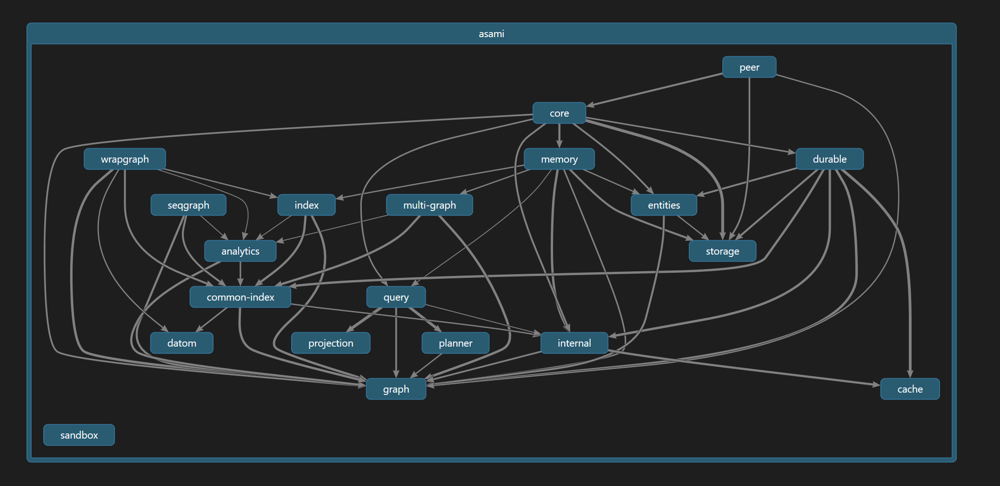
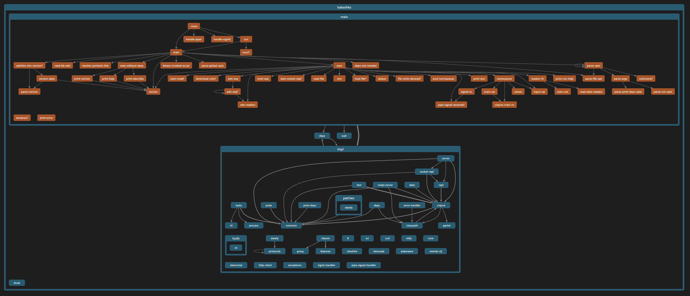
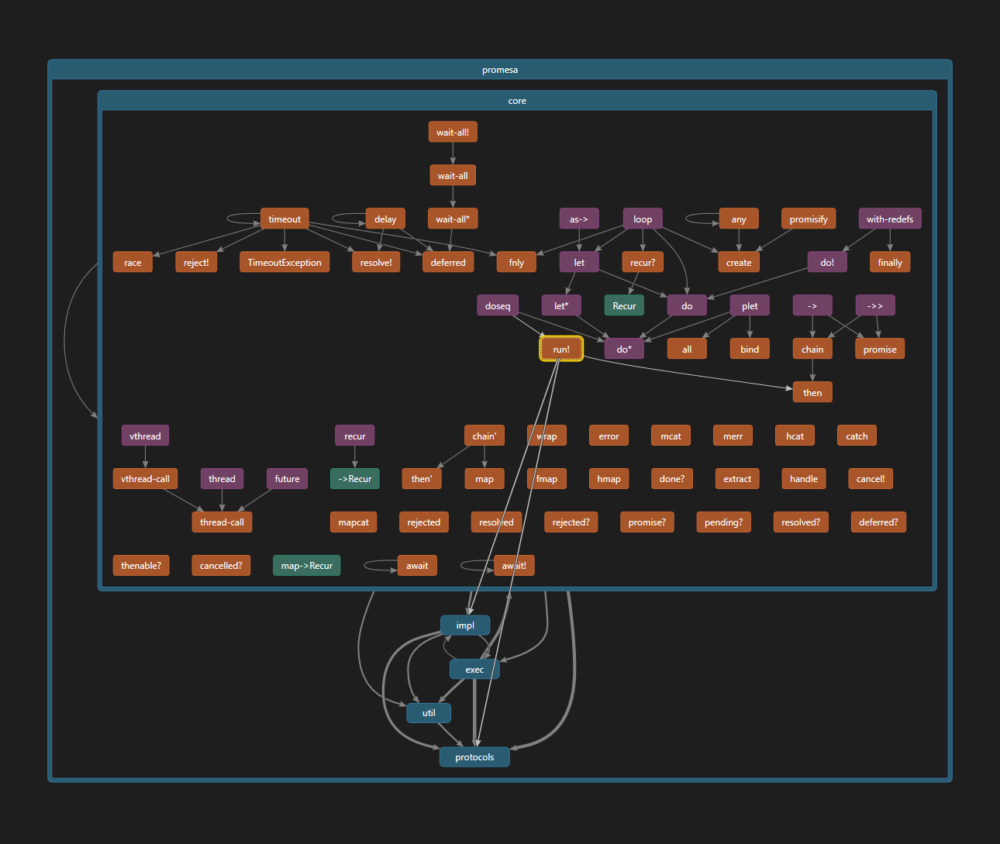
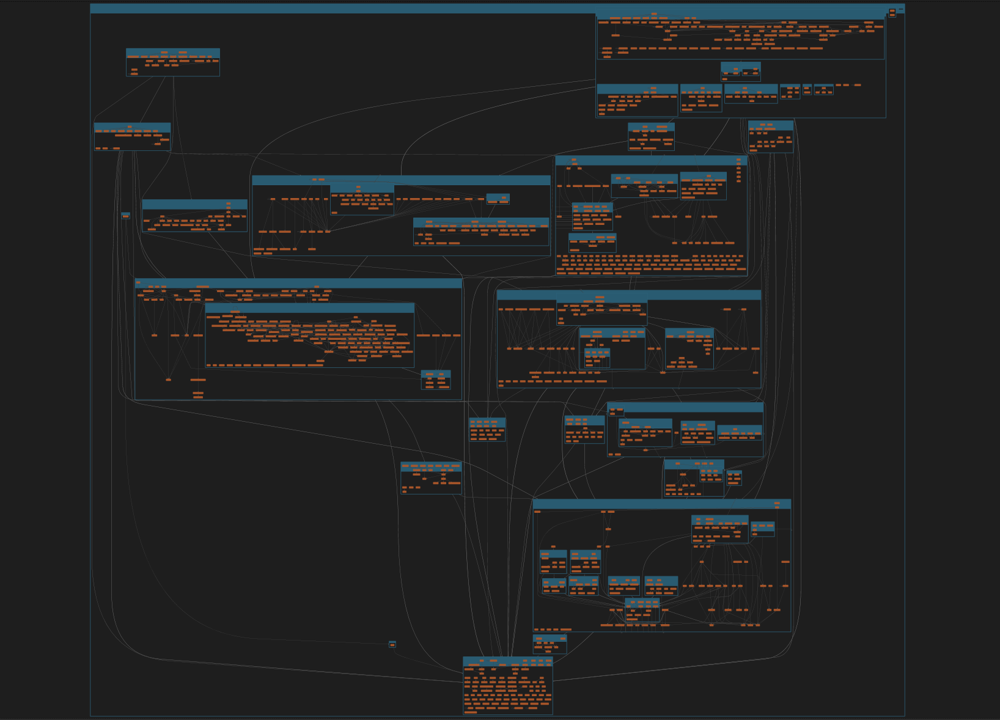

# Stratify

Stratify is a tool to visualize structure and dependencies of Clojure codebases.
Discover bits of Stratified Design that are hiding in your code.
Gain big picture understanding to make better decisions how to grow your system.

It leverages the [code map](https://learn.microsoft.com/en-us/visualstudio/modeling/browse-and-rearrange-code-maps?view=vs-2022) tool from Visual Studio,
which is designed for hiearachical graphs,
and allows to interactively collapse or expand the amount of shown information.

This is an advantage over static graph renderint tools like Graphviz 
which only work for trivial sized graphs,
because for a size of systems encountered in practice it becomes a tangle of lines.
That is overwhelming and does not aid much in understanding the structure.

| | |
| - | - |
|  |  |
|  |  |

The code map tool in Visual Studio uses [DGML](#about-dgml),
which is an XML-based format for representing directed graphs.
Visualizing a codebase is a two step process:
1. First, this tool reads Clojure code and outputs a DGML graph.
2. Then the graph is loaded and visualized using the DGML Editor in Visual Studio.


Watch the [demo video](https://www.youtube.com/watch?v=8LMrIpxxpDw) which shows several use cases:

- Big picture understanding - Explore a codebase top-down to gain insights about the system structure.
- Local understanding - Navigate and traverse the call graph to learn details about implementation.
- Refactoring simulation - Improve structure of a codebase by previewing results of refactoring.

## Usage

First extract DGML graph from source code.

#### Use without installing

```
clojure -Sdeps '{:deps{io.github.dundalek/stratify{:git/tag"v0.1.0":git/sha"f2c76ca"}}}' \
        -M -m stratify.main
```

#### Install by adding alias

`~/.clojure/deps.edn` to `:aliases` section

```clojure
{:aliases
 {:stratify
  {:extra-deps {io.github.dundalek/stratify {:git/tag "v0.1.0" :git/sha "f2c76ca"}}
   :main-opts ["-m" "stratify.main"]
```

Then run:
```
clojure -M:stratify path/to/src -o graph.dgml
```

### Using Visual Studio DGML Editor

Once you extracted the graph use [Visual Studio](https://visualstudio.microsoft.com/) to visualize it.

A downside is that Visual Studio is Windows-only, but it can be run in a Virtual Machine (VM) and there are VM images provided for developers.
It is [sufficient](https://learn.microsoft.com/en-us/visualstudio/modeling/analyze-and-model-your-architecture?view=vs-2022#VersionSupport) to use the free Community edition.

- Run Visual Studio in VM (optional)
  - [VM images](https://developer.microsoft.com/en-us/windows/downloads/virtual-machines/) for developers in various formats, e.g. for VirtualBox
  - Visual Studio 2022 Community edition is pre-installed
- Enable DGML Editor
  - menu Tools -> Get Tools and Features (opens Visual Studio Installer) -> Individual Components
    - check DGML Editor
- Install [DgmlPowerTools 2022](https://marketplace.visualstudio.com/items?itemName=ChrisLovett.DgmlPowerTools2022) extension ([source](https://github.com/clovett/DgmlPowerTools), optional)
  - provides extra features like neighborhood and butterfly exploration modes
  - menu Extensions -> Manage Extensions

## About DGML

[DGML](https://en.wikipedia.org/wiki/DGML) stands for Directed Graph Markup Language 

- Watch [Overview Video](https://www.youtube.com/watch?v=wIjCdOrZj-I) of the features and how to use the editor showcasing [examples](https://github.com/clovett/dgml).
- For more details see [Reference](https://learn.microsoft.com/en-us/visualstudio/modeling/directed-graph-markup-language-dgml-reference?view=vs-2022) and [XSD Schema](https://schemas.microsoft.com/vs/2009/dgml/).

Available renderers:

- DGML editor in Visual Studio 2022, Windows-only (recommended)
- [DGMLViewer](https://marketplace.visualstudio.com/items?itemName=coderAllan.vscode-dgmlviewer) plugin for Visual Studio Code, cross-platform
  - only viewer, no editing
  - does not seem to work very well, many examples cannot be opened
