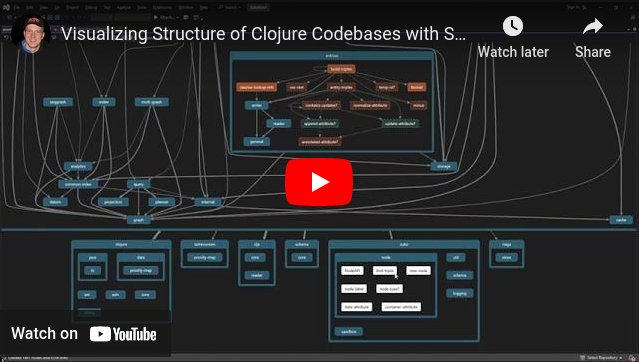
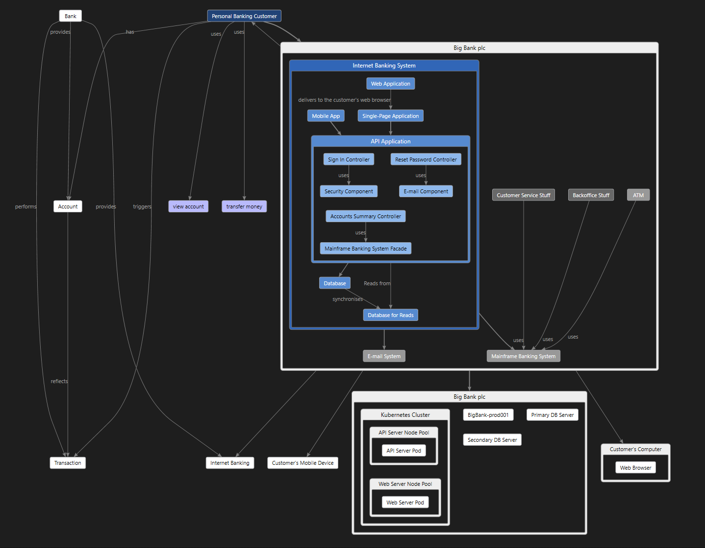
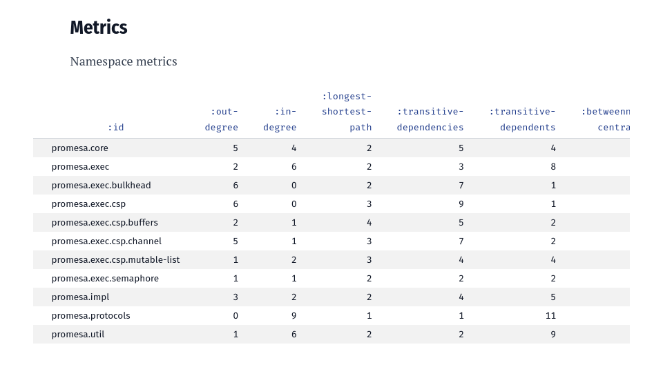
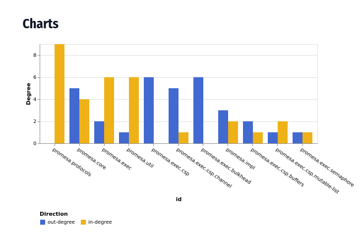

# Stratify

Stratify is a tool for exploring and improving architecture of software.
Discover bits of Stratified Design that are hiding in your code.
Gain big picture understanding to make better decisions how to grow your system.

- Code maps - Visualize structure and dependencies of codebases, supports following sources:
  - [Clojure/Script](#usage) code
  - [Graphviz](#graphviz-visualization) - Interactive visualization of outputs produced by other tools  
    (e.g. Go, JavaSript/TypeScript dependencies or others)
  - [Architecture maps](#architecture-maps) -  Explore C4 models
- [Metrics reports](#metrics-reports) -  Calculate code metrics and generate visual reports
- [Architecture checks](#architecture-checks) - Enforce architectural constrains, dependency rules, layer violations

For visualization it leverages the [code map](https://learn.microsoft.com/en-us/visualstudio/modeling/browse-and-rearrange-code-maps?view=vs-2022) tool from Visual Studio,
which is designed for hierarchical graphs,
and allows to interactively collapse or expand the amount of shown information.

This is an advantage over static graph rendering tools like Graphviz 
which only work for trivial sized graphs,
because for a size of systems encountered in practice it becomes a tangle of lines.
That is overwhelming and does not aid much in understanding the structure.

| | |
| - | - |
|  |  |
|  |  |

The code map tool in Visual Studio uses [DGML](#about-dgml),
which is an XML-based format for representing directed graphs.
Visualizing a codebase is a two step process:
1. First, this tool reads Clojure code and outputs a DGML graph.
2. Then the graph is loaded and visualized using the DGML Editor in Visual Studio.


Watch the [demo video](https://www.youtube.com/watch?v=8LMrIpxxpDw) which shows several use cases:

- Big picture understanding - Explore a codebase top-down to gain insights about the system structure.
- Local understanding - Navigate and traverse the call graph to learn details about implementation.
- Refactoring simulation - Improve structure of a codebase by previewing results of refactoring.

[](https://www.youtube.com/watch?v=8LMrIpxxpDw)

## Usage

First extract DGML graph from source code.

#### Use without installing

```
clojure -Sdeps '{:deps{io.github.dundalek/stratify{:git/tag"v0.2.0":git/sha"85fcdee"}}}' \
        -M -m stratify.main
```

#### Install by adding alias

`~/.clojure/deps.edn` to `:aliases` section

```clojure
{:aliases
 {:stratify
  {:extra-deps {io.github.dundalek/stratify {:git/tag "v0.2.0" :git/sha "85fcdee"}}
   :main-opts ["-m" "stratify.main"]
```

Then run:
```
clojure -M:stratify path/to/src -o graph.dgml
```

#### Options

```
Usage: stratify <options> <src-paths>

Options:
  -o, --out                  <file>   -   Output file, default "-" standard output
  -f, --from                 <format> clj Source format, choices: "clj", "dot", "overarch"
      --flat-namespaces                   Render flat namespaces instead of a nested hierarchy
      --include-dependencies              Include links to library dependencies
      --metrics                           Calculate and serve namespace metrics report
  -h, --help                              Print this help message and exit
```

### Using Visual Studio DGML Editor

Once you extracted the graph use [Visual Studio](https://visualstudio.microsoft.com/) to visualize it.

A downside is that Visual Studio is Windows-only, but it can be run in a Virtual Machine (VM) and there are VM images provided for developers.
It is [sufficient](https://learn.microsoft.com/en-us/visualstudio/modeling/analyze-and-model-your-architecture?view=vs-2022#VersionSupport) to use the free Community edition.

- Run Visual Studio in VM (optional)
  - [VM images](https://developer.microsoft.com/en-us/windows/downloads/virtual-machines/) for developers in various formats, e.g. for VirtualBox
  - Visual Studio 2022 Community edition is pre-installed
- Enable DGML Editor
  - menu Tools -> Get Tools and Features (opens Visual Studio Installer) -> Individual Components
    - check DGML Editor
- Install [DgmlPowerTools 2022](https://marketplace.visualstudio.com/items?itemName=ChrisLovett.DgmlPowerTools2022) extension ([source](https://github.com/clovett/DgmlPowerTools), optional)
  - provides extra features like neighborhood and butterfly exploration modes
  - menu Extensions -> Manage Extensions

### Graphviz visualization

To convert Graphviz `.dot` format to DGML pass the `-f dot` option:

```
clojure -M:stratify graph.dot -f dot -o graph.dgml
```

By default nested hierarchy is created based on segments using `/` as separator.  
Pass the `--flat-namespaces` option for flat nodes without nesting.

##### Extract Go dependencies as Graphviz dot file

Use [goda](https://github.com/loov/goda) to extract dependency graph,
which is then converted to DGML.

```
go install github.com/loov/goda@latest
```

From within a Go project:

```
goda graph "./..." > graph.dot
```

Or to also include dependencies:

```
goda graph "./:all" > graph-all.dot
```

##### JavaScript/TypeScript dependencies visualization

Use [Dependency cruiser](https://github.com/sverweij/dependency-cruiser) to extract JS/TS dependencies as Graphviz dot file:

```
bunx depcruise src --include-only "^src" --output-type dot > graph.dot
```

To also include dependencies:

```
bunx depcruise src --output-type dot > graph.dot
```

### Architecture maps

View [C4](https://c4model.com) architecture models expressed in [Overarch](https://github.com/soulspace-org/overarch) format.

When a model becomes large it can end up overwhelming.
Overarch lets you choose upfront which parts of your model to render as static diagrams.
However, it can be useful to see the entire model at once,
explore it interactively, and drill down to areas of interest as needed.

To convert an architecture model to DGML use the `-f overarch` option and pass the model directory:

```
clojure -M:stratify models/banking -f overarch -o banking.dgml
```

Here is a rendering of the example [banking model](https://github.com/soulspace-org/overarch/blob/0551900472757ca1cf5973f5e598da534d49367e/models/banking/model.edn):



### Metrics reports

Use the  `--metrics` option to calculate code metrics for given source paths and generate a report.
[Clerk](https://github.com/nextjournal/clerk) is used to start a local web server which renders a notebook as a web page.
Metrics and charts can be adapted by customizing the [notebook.clj](resources/io/github/dundalek/stratify/notebook.clj).

```
clojure -M:stratify src --metrics
```

Use the `-o` / `--out` to generate the report as a HTML file.
It can be useful to run periodically on CI and upload the HTML report to a static hosting server.

```
clojure -M:stratify src --metrics -o report.html
```

| | |
| - | - |
|  |  |

### Architecture checks

The goal is to be able to define rules for code like architectural constraints, dependency rules, and layer violations.
It is inspired by [ArchUnit](https://www.archunit.org) with a difference of using graph queries ([Datalog](https://www.learndatalogtoday.org)) aiming to be mostly programming language agnostic and only needing thin adapters.

Currently, the feature is not ready yet.
There is a work-in-progress namespace [queries.clj](src/io/github/dundalek/stratify/queries.clj) used for experiments in the REPL to demonstrate the approach.
The result from code analysis is loaded into in-memory [DataScript](https://github.com/tonsky/datascript) database and queries to check code rules run against it.
Future work will be to try to express various rules, identify common patterns, and create more concise helpers.

## About DGML

[DGML](https://en.wikipedia.org/wiki/DGML) stands for Directed Graph Markup Language 

- Watch [Overview Video](https://www.youtube.com/watch?v=wIjCdOrZj-I) of the features and how to use the editor showcasing [examples](https://github.com/clovett/dgml).
- For more details see [Reference](https://learn.microsoft.com/en-us/visualstudio/modeling/directed-graph-markup-language-dgml-reference?view=vs-2022) and [XSD Schema](https://schemas.microsoft.com/vs/2009/dgml/).

Available renderers:

- DGML editor in Visual Studio 2022, Windows-only (recommended)
- [DGMLViewer](https://marketplace.visualstudio.com/items?itemName=coderAllan.vscode-dgmlviewer) plugin for Visual Studio Code, cross-platform
  - only viewer, no editing
  - does not seem to work very well, many examples cannot be opened
